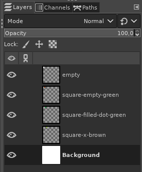
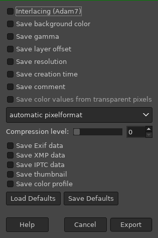
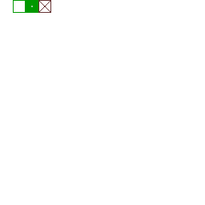
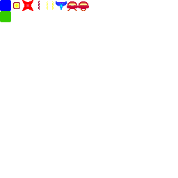

### tools for extracting resources from png files

## editing tiles and sprites data
edit gimp files "sprites.xcf" and "tiles.xcf"

## exporting to png for processing
* enable all layers

* File -> Export As...

## extracting resources
run script `./extract-to-resources.sh`
which will overwrite `game/resources/*` files

note. make sure transparency pixel is palette index 0

## current resources
tiles:

sprites:

