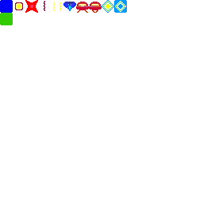

### tools for extracting resources from png files
* edit gimp files "sprites.xcf" and "tiles.xcf"
* create a layer for each sprite / tile

#### exporting to png for processing
* enable all layers

* File -> Export As...

#### extracting resources
script `./extract-to-resources.sh` will overwrite `game/resources/*` files

note. make sure transparency pixel is palette index 0

#### current resources
tiles:

sprites:

